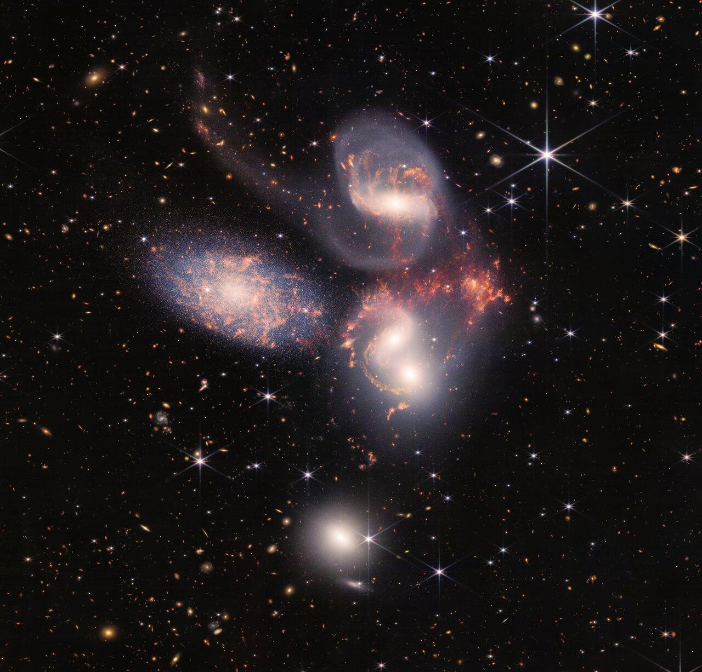
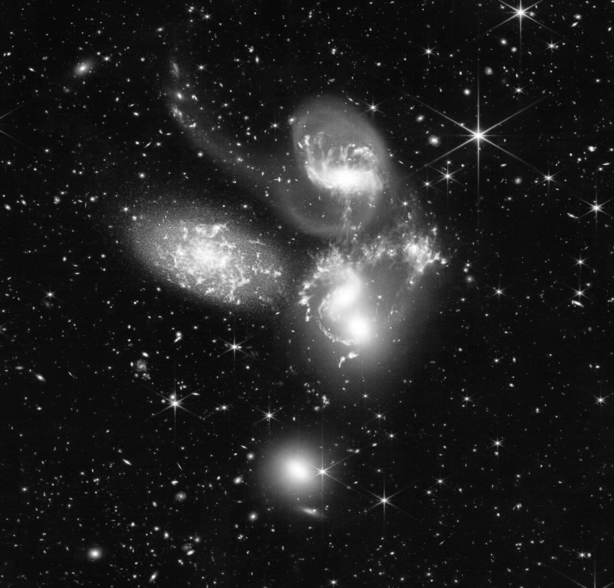
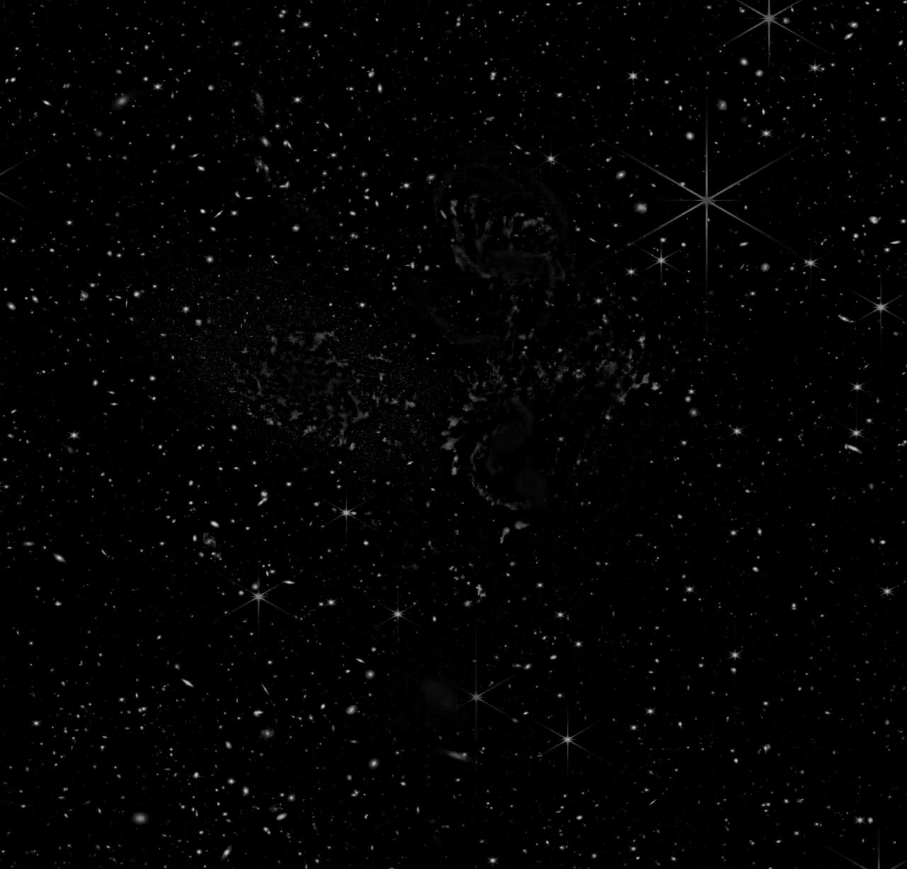
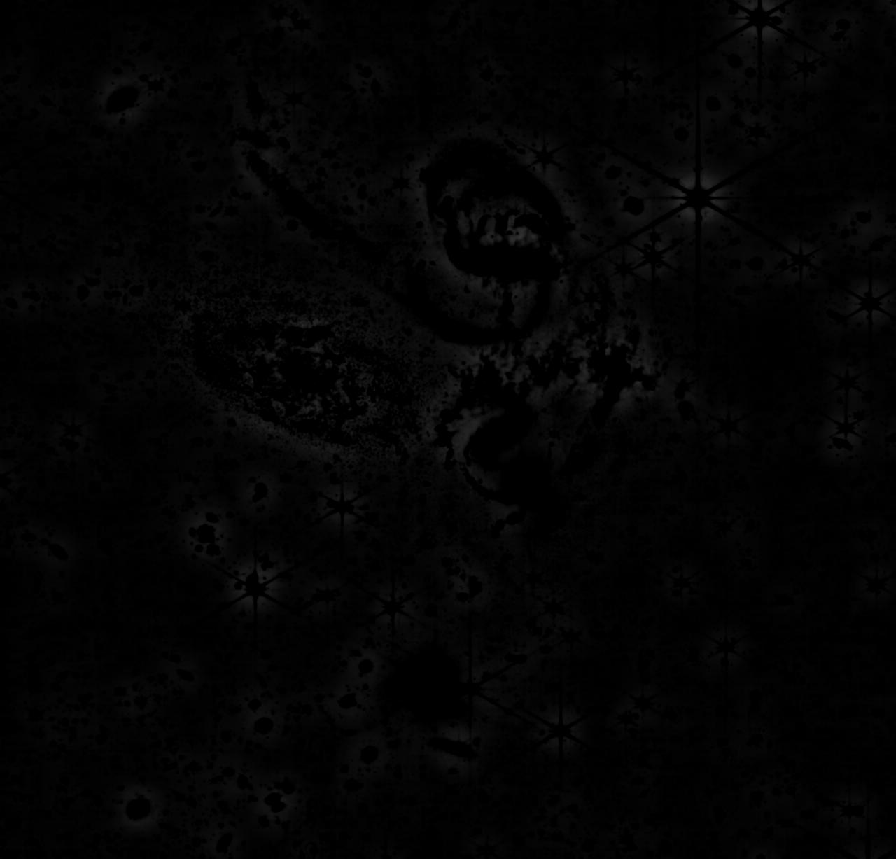
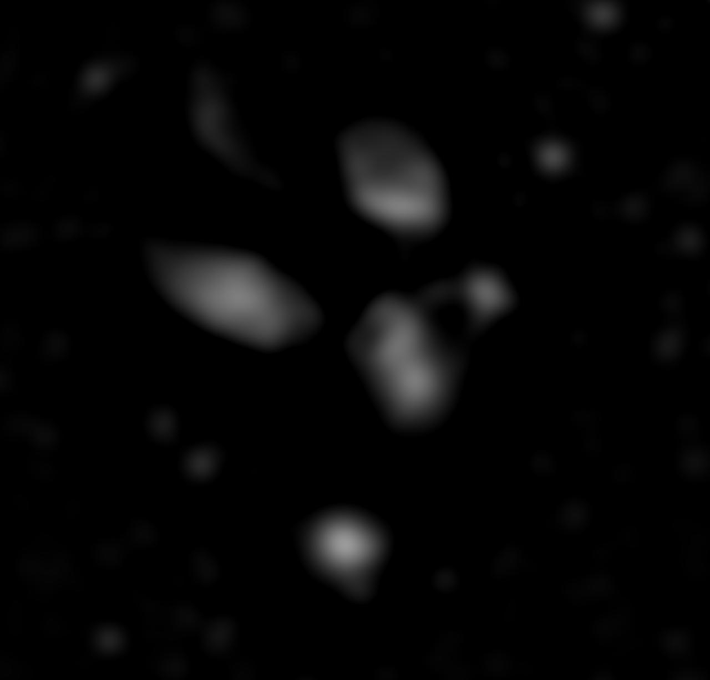

<h1 align="center">🔭 JWST Star Clustering</h1>

<p align="center">
  <em>Multi-scale image decomposition of a James Webb Space Telescope deep-field —
  separating stars, dust, and galaxies by spatial frequency as the front end of a star-clustering pipeline.</em>
</p>

<p align="center">
  
  
  
</p>

---

## ✨ Results

Starting from a single JWST image of **Stephan's Quintet**, the pipeline pulls apart three
physically distinct populations — each living at a different spatial scale — using nothing but
color-space transforms and Gaussian filtering.

<table>
  <tr>
    <td align="center" width="50%">
      <br>
      <b>Input</b> — JWST Stephan's Quintet
    </td>
    <td align="center" width="50%">
      <br>
      <b>Working channel</b> — HSV brightness (Value)
    </td>
  </tr>
</table>

### The three separated layers

<table>
  <tr>
    <td align="center" width="33%"></td>
    <td align="center" width="33%"></td>
    <td align="center" width="33%"></td>
  </tr>
  <tr>
    <td align="center"><b>⭐ Stars</b><br><sub>high-pass · compact point sources</sub></td>
    <td align="center"><b>🌫️ Dust</b><br><sub>narrow band-pass · mid-scale structure</sub></td>
    <td align="center"><b>🌌 Galaxies</b><br><sub>wide band-pass · large smooth bodies</sub></td>
  </tr>
</table>

> The galaxy layer cleanly resolves into **five luminous blobs — the five members of the Quintet** —
> while the star layer isolates thousands of point sources and the telltale 6-spike JWST diffraction
> pattern. Same input, three different spatial-frequency bands, three different astrophysical populations.

---

## 🚀 Why this matters

Before you can *measure* anything in an astronomical image, you have to *separate* what's in it.
A raw frame is a superposition of overlapping signals — foreground stars, diffuse dust and gas,
extended galaxies, and the background sky — all stacked on top of one another. **Source separation
and background estimation are the unglamorous front end of essentially every professional astronomy
pipeline.**

This is the same class of problem solved at scale by groups like **NASA/JPL** and **Caltech/IPAC**
(which processes the infrared archives for Spitzer, WISE/NEOWISE, and 2MASS): estimate and subtract a
slowly varying background, isolate point sources from extended emission, and decompose a scene across
spatial scales so that downstream algorithms — photometry, source catalogs, clustering — operate on a
clean signal instead of a mixture. Tools such as **Source Extractor (SExtractor)** are built on exactly
this idea: model the background with a smooth surface, subtract it, and what survives is real structure.

This project implements that front end from first principles and points it at the next step the name
promises: **feeding the isolated star layer into an unsupervised clustering algorithm** (e.g. DBSCAN)
to find stellar associations and over-densities — the kind of grouping that flags star-forming knots
and tidal debris in an interacting system like the Quintet.

**Skills demonstrated:** spatial-frequency / scale-space analysis · color-space transforms ·
unsharp masking & Difference-of-Gaussians · background subtraction · principled parameter selection ·
building a reproducible image-processing pipeline.

---

## 🧠 Process & design decisions

The whole pipeline keys off one insight: **the structures we care about are separated not by color,
but by *size*.** Stars are tiny and sharp; dust is medium and clumpy; galaxy bodies are large and
smooth. Spatial-frequency filtering is the natural tool.

**1 — Light denoise (3×3 Gaussian, σ = 0.5).**
A gentle blur knocks down per-pixel sensor noise without touching real structure, so later
subtractions aren't dominated by speckle.

**2 — Convert RGB → HSV, then work only on the Value channel.**
HSV decouples *brightness* (which carries the morphology) from *color*. Crucially, **Hue and
Saturation are numerically unstable in the dark sky** — where there's almost no light, the color
angle is essentially random, which is why those channels (images 4–5) look like static. Brightness
is stable everywhere, so the entire pipeline runs on the **Value** channel and discards H/S.

**3 — Stars via high-pass (unsharp masking).**
`stars = Value − blur(Value, σ=8)`. The blurred copy is a *local background estimate* — the smooth
galaxy glow and sky. Subtract it and only the compact, high-frequency sources survive: stars and
diffraction spikes. This is textbook unsharp masking, and conceptually identical to the
background-subtraction step in source-extraction pipelines.

**4 — Dust & galaxies via band-pass (Difference of Gaussians).**
A Difference of Gaussians keeps only the band of spatial scales *between* two blur radii — a classic
scale-space / blob-detection operator (Marr–Hildreth, and the same trick behind SIFT).

| Layer | Operation | Scale band isolated |
|-------|-----------|---------------------|
| Dust | `blur(σ=18) − blur(σ=1)` | **mid-scale** — clumpy dust lanes & star-forming knots |
| Galaxies | `blur(σ=18) − blur(σ=100)` | **large-scale** — smooth galaxy bodies, point sources erased |

The σ values are the design knobs: the small inner radius for dust still rejects the largest galaxy
glow, while the wide outer radius for galaxies erases everything *smaller* than a galaxy, leaving five
clean blobs.

---

## 🖼️ What each image shows

| # | Image | What it is |
|---|-------|-----------|
| 1 | [`1_original.jpg`](results/1_original.jpg) | **Input** — JWST's Stephan's Quintet: five galaxies, foreground stars with 6-point diffraction spikes, and thousands of faint background galaxies. |
| 2 | [`2_gaussian_applied.jpg`](results/2_gaussian_applied.jpg) | **Denoised** — after the 3×3 Gaussian; visually almost identical, but per-pixel noise is suppressed. |
| 3 | [`3_hsv_version.jpg`](results/3_hsv_version.jpg) | **HSV (shown as RGB)** — the false-color look confirms we're now in HSV space, ready to split channels. |
| 4 | [`4_hue_channel.jpg`](results/4_hue_channel.jpg) | **Hue** — looks like static across the sky: hue is undefined where there's no color/light. A direct illustration of *why we don't use it.* |
| 5 | [`5_saturation_channel.jpg`](results/5_saturation_channel.jpg) | **Saturation** — color *intensity*; noisy in the background, with some structure in the galaxies. Also discarded. |
| 6 | [`6_value_channel.jpg`](results/6_value_channel.jpg) | **Value (brightness)** — the clean grayscale workhorse. Every star, spike, dust lane, and galaxy is present and stable. Everything downstream builds on this. |
| 7 | [`7_blurred_value_channel.jpg`](results/7_blurred_value_channel.jpg) | **Blurred Value (σ=8)** — the *local background estimate*. Stars melt away; the smooth galaxy glow remains. This is what gets subtracted to find stars. |
| 8 | [`8_stars_grayscale.jpg`](results/8_stars_grayscale.jpg) | **⭐ Stars** — high-pass result. Compact point sources and diffraction spikes pop out on black; dust lanes appear as dark voids (they sit *below* the local background). |
| 9 | [`9_dust_grayscale.jpg`](results/9_dust_grayscale.jpg) | **🌫️ Dust** — narrow band-pass. Point sources and the broad glow are both gone, leaving the faint, mottled mid-scale texture of dust lanes and star-forming clumps inside the galaxies. |
| 10 | [`10_galaxy_grayscale.jpg`](results/10_galaxy_grayscale.jpg) | **🌌 Galaxies** — wide band-pass. Stars are erased and only large-scale luminous structure survives: the **five galaxy bodies of the Quintet** as distinct smooth blobs. |

---

## ▶️ Running it

Requires **MATLAB** + the **Image Processing Toolbox**.

```matlab
% from the repo root, with the image on the MATLAB path
run('src/star_clustering.m')
```

The script loads `images/stephans_quintet.jpg`, builds the full 3×6 stage figure, and the
intermediate layers shown above are written to `results/`.

```
JWST-StarClustering/
├── images/                     # source JWST image
├── src/star_clustering.m       # the pipeline
├── results/                    # stage-by-stage outputs (shown above)
└── README.md
```

---

<p align="center"><sub>
Source image: NASA, ESA, CSA, STScI — JWST observation of Stephan's Quintet. Used here for
educational image-processing purposes.
</sub></p>
